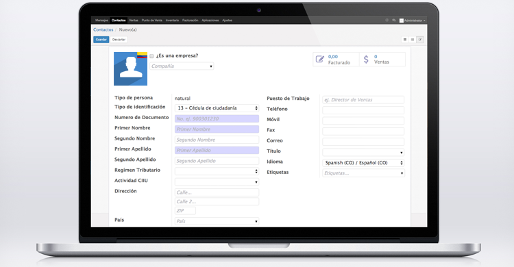

Localización Colombia: Terceros
======

Reglas Locales
-----------------
En Colombia hay algunas reglas locales que deben aplicarse al crear un nuevo contacto.
Este módulo está diseñado a partir de los requisitos legales de la autoridad tributaria en Colombia.

- Es bastante común que las personas tengan hasta 4 nombres. Todos estos son importantes para separar.
- El Código CIIU de una empresa muestra la Clasificación Industrial de una empresa. Esta información será importante para el cálculo de impuestos y estadísticas.
- En Colombia hay muchos tipos de identificación que deben ser muy claros en casi todas las transacciones.
- NIT es el número de identificación de casi todas las empresas. El código de verificación se calculará automáticamente.

Lo que obtienes
-----------------
- Rediseño del formulario de contacto debido a las reglas locales antes mencionadas que deben aplicarse en Colombia:
- Campos adicionales: nombre, segundo nombre, apellido, segundo apellido
- Campos adicionales: Tipo de persona, Tipo de documento, Número de documento, Régimen tributario, Código CIIU
- Manejo de todo tipo de identificación que sean relevantes en Colombia.
- Formulario inteligente: los campos serán revisados ​​para ver si están correctos y completos.
- Número de identificación agregado a la vista de árbol
- Número de identificación agregado a la vista KanBan
- Identificador visual para contactos incompletos en Kanban y vista de árbol
- Autocompletar de NIT: Escriba el NIT y el dígito de verificación se calculará automáticamente
- Descripción de las actividades económicas (Código CIIU), incluida la lista completa para mantenerla
- Mantenga la lista de CIIU bajo este nuevo punto de menú: Contabilidad / Configuración / Contabilidad / CIIU
- Los contactos se pueden encontrar por número de identificación (por ejemplo, NIT)
- Se agregó una lista completa de todas las ciudades y departamentos en Colombia.
- Lógica de dependencia de país, departamento y municipio para evitar la confusión de ubicaciones con el mismo nombre
- La combinación de identificación / tipo de documento se verificará ya que debe ser única
- Todos los cambios disponibles en inglés (elegir idioma: en_GB)

Como instalar
-----------------
Configure un entorno de ejecución de Odoo en su máquina (local o remoto). Aquí hay dos enlaces sobre cómo instalar odoo localmente en Ubuntu y Mac:
Ubuntu: https://goo.gl/mgEbUR
Mac: http://goo.gl/hXBqfG

Una vez que tenga una instalación en ejecución, puede instalar este módulo de varias maneras:

1. Vaya a la carpeta de complementos de su instalación de Odoo y escriba "git clone <repository-master>". 

2. Puedes descargar el archivo ZIP y extraer todos los archivos. Tenga en cuenta que la carpeta que agregará a la ruta de sus complementos se llama "l10n_co_res_partner".

3. Instala Docker en tu computadora y sigue estas instrucciones: https://goo.gl/5p8Q7Y

Reinicie su servidor y vaya a la pestaña de aplicaciones. Cambie al modo de desarrollador y actualice la lista de aplicaciones. Luego puedes buscar el módulo como "colombia" o "Terceros". Instalarlo. Que te diviertas.

Licencia
-----------------
LComo muchos otros módulos para Odoo, este proyecto se ejecuta bajo la licencia AGPL-3 (http://www.gnu.org/licenses/agpl-3.0.html).

Todos están autorizados a copiar y distribuir copias literales de este documento de licencia, pero no está permitido cambiarlo.

Retroalimentación
-----------------
Queremos mejorar constantemente nuestro software, por lo tanto, nos encanta la retroalimentación. Siéntase libre de comentar en cualquier momento nuestro código.
Si cree que falta algo, no dude en enviar un mensaje.

Contactos
-----------------
Así es como puedes llegar a los colaboradores:

Alfredo Bravo Cuero: yo@alfredobravocuero.co

